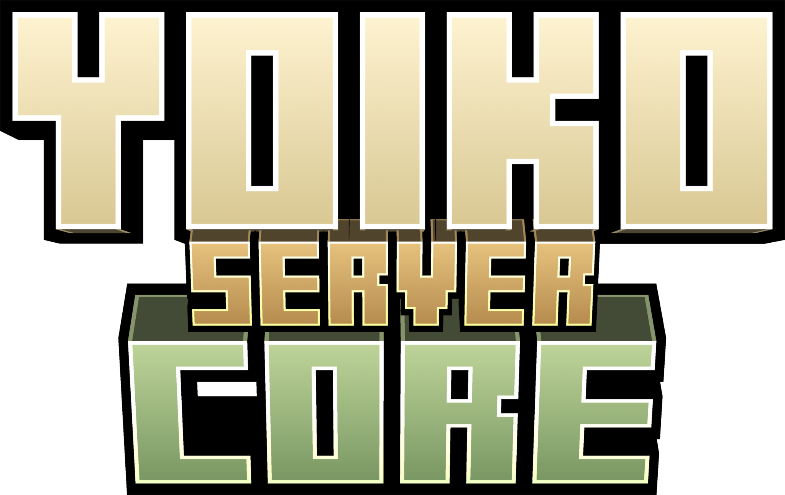
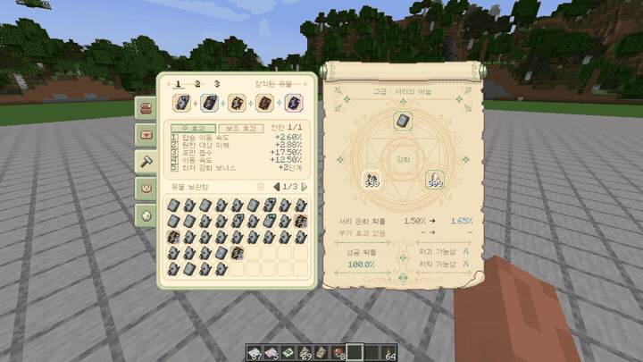
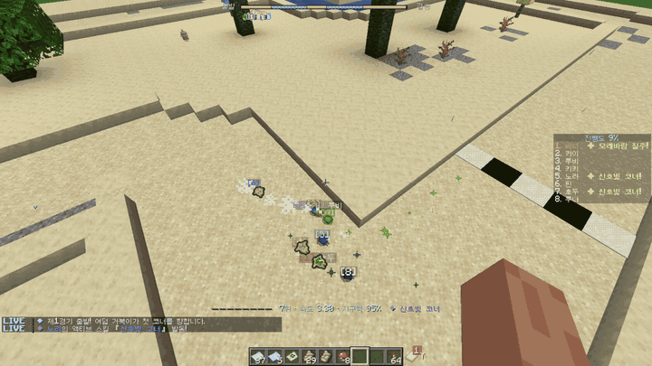

  

# Yoiko Server Core

> 개인 코블몬 서버에서 사용하는 NeoForge 1.21.1 모드입니다. 성장, 경제, 보상, 수집, 이벤트 기능을 담고 있습니다.

> [!IMPORTANT]
> 이 모드에 쓰인 UI 도트 그래픽과 아이콘은 직접 그린 작업물입니다. 무단 복제 및 사용을 허용하지 않습니다.

이 저장소에는 직접 작성한 Java 코드와 주요 구현 내용을 공개합니다. 실행에 필요한 게임 리소스와 외부 모드는 들어 있지 않습니다. 따라서 저장소만 내려받아서는 모드를 실행할 수 없습니다.

## 주요 화면

프로필, 보관함, 우편, 거래소, 수집, 보상 기능을 한 메뉴에서 관리합니다. 진행 상황을 확인하거나 받은 보상을 정리할 때 여러 명령어와 화면을 찾아다닐 필요가 없습니다.

<table>
  <tr>
    <td width="50%"></td>
    <td width="50%"></td>
  </tr>
  <tr>
    <td align="center">보관함과 프로필</td>
    <td align="center">유물 관리와 강화</td>
  </tr>
</table>

## 시스템 상세

### 통합 메뉴와 공개 프로필

전용 단축키를 누르면 마지막으로 사용한 메뉴가 다시 열립니다. 화면 왼쪽의 탭으로 보관함·우편함·유물·거래소·거북이 경주를 오갈 수 있습니다. 읽지 않은 우편이나 판매 완료 알림은 탭에 배지로 표시합니다. 다른 메뉴로 이동해도 페이지와 커서 위치는 그대로 유지됩니다.

개인 보관함은 27칸으로 시작하며 유물 효과로 크기를 늘릴 수 있습니다. 한 페이지에는 54칸이 표시됩니다. 현재 페이지만 정렬하거나 특정 슬롯을 잠글 수도 있습니다. 잠근 슬롯의 아이템은 옮기거나 정렬하지 않습니다.

공개 프로필에서는 대표 칭호와 업적을 비롯해 활동, 가챠, 유물, 보물 토끼, 거북이 경주 기록을 볼 수 있습니다. 프로필 공개 여부는 플레이어가 직접 정합니다. 재화 잔액·인벤토리·좌표·유물의 정확한 효과 수치와 개인 기록은 다른 사람에게 보여 주지 않습니다.

### 접속 보상과 가챠

_세 개의 일일 보너스 상자와 7일 연속 접속 보상_

첫 접속 보상과 연속 접속 보상은 우편함에 지급 내역을 남겨 중복 수령을 막습니다. 일일 보상 화면에는 7일치 연속 접속 보상과 세 개의 보너스 상자가 함께 나옵니다. 서버는 플레이어와 날짜에 따라 상자 내용을 미리 정합니다. 열쇠를 모두 쓰고 나면 열지 않은 상자의 내용도 확인할 수 있습니다. 일일 보상과 열쇠 지급 횟수, 상점의 일일 구매 한도는 서버 설정에 지정한 시각에 함께 초기화됩니다.

포켓몬 가챠를 시작하면 서버가 후보 세 마리와 공의 위치를 먼저 정합니다. 플레이어는 월드에 나타난 공 가운데 하나를 고릅니다. 공을 고르기 전에 취소하거나 죽거나, 차원을 이동하거나, 제한 시간이 지나면 티켓을 돌려받습니다. 공을 고른 뒤에는 처음 정해 둔 결과를 지급하므로 연출을 본 다음 다시 뽑을 수 없습니다. 후보 정보와 선택 권한은 서버가 확인하고, 클라이언트는 공이 떨어지고 흔들리다가 포켓몬이 등장하는 모습만 보여 줍니다.

가챠 도감에는 티켓별 포켓몬·유물 목록과 희귀도, 개별 확률이 나옵니다. 포켓몬, 유물, 파티클 장식은 서로 다른 티켓과 추첨 방식을 씁니다. 서버는 천장 진행 횟수와 획득 통계를 플레이어 데이터에 저장합니다.

### 재화, 거래소와 우편함

서버 재화는 금화와 보석 두 가지입니다. 금화는 건축 재료를 사거나 다른 플레이어와 거래할 때 씁니다. 보석은 서버에서 정한 가챠 티켓과 장식으로 교환할 수 있습니다. 일일 상자에서 이미 가진 고희귀도 장식이 또 나오면 서버 설정에 정한 만큼 보석으로 바꿔 줍니다.

거래소 화면에서 서버 상점과 플레이어 판매 목록을 살펴보고, 내 판매 목록과 지난 기록을 관리할 수 있습니다. 아이템을 등록하면 서버가 곧바로 보관합니다. 취소하거나 판매 기간이 끝난 아이템과 판매 대금은 인벤토리 또는 우편으로 돌려줍니다. 등록 전에는 총액, 개당 가격, 수수료, 예상 정산액을 보여 줍니다. 최근 거래가의 중앙값과 차이가 큰 가격에는 경고가 붙습니다.

접속 보상, 거래 대금, 이벤트 보상, 운영자가 보낸 아이템은 우편함으로 받습니다. 접속하지 않은 플레이어의 우편도 서버에 보관합니다. 첨부 아이템을 모두 받은 우편은 읽음 처리 뒤 자동으로 정리됩니다. 보관 한도와 복구 대기열을 두어 우편이 끝없이 쌓이거나 거래 보상이 사라지지 않게 했습니다.

### 유물

   
  <em>강화 재료를 사용해 유물의 효과 수치를 높이는 과정</em>

유물에는 희귀도, 주 효과, 보조 효과, 강화 수치가 붙습니다. 장착 슬롯은 다섯 칸이며 프리셋은 세 개까지 저장할 수 있습니다. 보관함에서 유물을 강화하거나, 필요 없는 유물을 한꺼번에 분해해 강화 재료로 바꿀 수도 있습니다. 강화 단계는 `+0`부터 `+10`까지입니다. 단계별 성공 확률과 능력치 증가량은 서버 설정에서 정합니다.

같은 효과의 유물을 여러 개 장착해도 가장 높은 수치 하나만 적용됩니다. 같은 특별 그룹에 속한 유물도 한 번에 하나만 쓸 수 있습니다. 프리셋을 바꾸거나 강화를 마치면 서버가 전체 장착 상태를 확인한 뒤 결과를 반영합니다. 보관함 확장 효과가 줄었을 때 잠기게 될 칸에 아이템이 남아 있다면 유물을 해제하거나 교체할 수 없습니다.

유물은 코블몬의 경험치·친밀도·포획률·야생 출현에 영향을 줍니다. 이동 속도·체력·상호작용 거리 같은 플레이어 능력을 높이는 유물도 있습니다. Waystones, Mega Showdown, 음식 품질 모드, 치명타 모드가 설치되어 있으면 각 모드와 연동되는 유물도 사용할 수 있습니다.

### 꾸미기와 칭호

꾸미기 아이템은 머리·몸·발에 장착하는 모델 장식과 트레일·고리·궤도·날개·오라·동행체 형태의 파티클 장식으로 나뉩니다. 모델 장식은 플레이어의 머리와 몸을 따라 움직입니다. 파티클 장식은 주변 플레이어의 클라이언트에서 각각 그립니다. 거리가 멀거나, 화면에 사람이 많거나, 프레임이 떨어지면 파티클 수를 줄입니다.

보유 목록은 종류별로 찾아볼 수 있고, 즐겨찾기한 장식을 위로 모아 정렬할 수 있습니다. 캐릭터 미리보기에서는 아직 갖지 않은 모델도 착용해 볼 수 있습니다. 미리보기 화면에서만 보일 뿐 서버에 저장된 장착 정보는 바뀌지 않습니다.

칭호는 장식 화면에서 고릅니다. 선택한 칭호 아이콘은 채팅, 플레이어 목록, 월드의 이름표에 표시됩니다. 칭호를 해제해도 획득 기록은 남습니다.

### 서버 이벤트와 주간 신문

일일 이벤트의 날짜는 보상과 같은 시각에 바뀝니다. 이때 그날의 야생 포켓몬 이로치 확률 배율도 정합니다. 단기 속보에는 대량 발생, 협동 포획, 보물 토끼 무리, 낚시 축제가 있습니다. 서버 전체에서 한 번에 하나만 열리므로 참가자와 보상 정보가 다른 이벤트와 섞이지 않습니다.

협동 포획의 공동 목표치는 접속 인원에 따라 달라지며, 한 사람이 채울 수 있는 기여도에는 상한이 있습니다. 대량 발생과 보물 토끼 무리가 시작되면 월드에 탐색 지역이 생깁니다. Xaero 월드맵이 설치되어 있으면 지도에도 범위를 표시합니다. 잉어킹 낚시 축제는 매주 토요일 정해진 시간과 수역에서 열립니다. 축제에서는 일반 낚시와 다른 결과가 나오며, 처음 참가하면 별도 보상도 받을 수 있습니다.

일반 탐험에서 만나는 보물 토끼는 서버 전체 속보와 관계없는 개인 이벤트입니다. 토끼의 종류에 따라 금화·보석·가챠 티켓·유물 재료를 얻습니다. 왕관 토끼는 여러 플레이어가 함께 쫓아야 합니다.

주간 신문에는 한 주 동안 기록한 유물·이로치 획득, 보물 토끼 발견, 거래소 판매, 속보 결과가 실립니다. 기록을 그대로 나열하지 않고 내용에 맞는 기사로 바꿔 우편으로 발행합니다. 신문에 딸린 보상은 다른 우편과 같은 방법으로 받습니다.

### 거북이 경주

   
  <em>모래와 수면 구간에서 진행되는 거북이 경주</em>

거북이가 부화할 때 속력·가속력·코너링·추월·지구력의 다섯 능력치와 고유 액티브 스킬, 패시브 스킬이 정해집니다. 훈련 횟수가 제한되어 있으므로 어떤 능력치를 키울지 직접 골라야 합니다. 발전 과제로 얻은 동행 친구와 등딱지 외형도 설정할 수 있습니다.

경주 전략은 선두 주행, 안정 주행, 대열 추적, 막판 승부 네 가지입니다. 전략을 바꾸면 목표 속도와 자리 잡는 방식, 추월 시점, 지구력 배분이 달라집니다. 코스는 모래·진흙·수면 구간을 조합해 만듭니다. 맑음, 가랑비, 바닷바람, 숲 안개 같은 경기장 날씨는 스킬과 동행 친구의 발동 조건에 영향을 줍니다.

공식전에서 레이스 포인트를 얻으면 D 등급부터 S 등급까지 올라갈 수 있습니다. 시범전과 타임어택에는 성장 보상이 없지만 여러 난이도와 코스를 시험할 수 있습니다. 관전 화면에서는 전용 HUD와 경기 해설로 순위, 지구력, 스킬 발동, 주요 구간을 확인합니다. 베팅과 경기 다시 보기, 운영자용 코스·효과 미리보기에서도 같은 경기 데이터를 씁니다.

부화 결과, 훈련 내용, 패시브 재선택 후보, 경기 기록은 서버에 먼저 저장합니다. 접속이 끊기거나 서버가 다시 시작되어도 사용한 재료가 사라지거나 확정된 후보가 바뀌지 않도록 각 단계를 따로 처리합니다.

### 저장과 운영 안전성

재화, 우편, 거래소, 이벤트, 경주 결과는 서버가 최종 판단합니다. 클라이언트에서 요청이 들어오면 서버가 대상·거리·소유권과 현재 상태를 다시 확인합니다. 요청을 처리하는 동안에는 해당 버튼을 잠급니다. 응답이 늦을 때는 자동으로 다시 요청하지 않고 오류만 알려 중복 처리를 막습니다.

플레이어 데이터와 서버 공용 데이터는 용도에 따라 나눠 저장합니다. 재화 이동과 주요 운영 작업은 별도의 감사 기록에 남깁니다. 설정 파일은 항목과 버전을 확인한 뒤 불러옵니다. 유물 설정처럼 진행 데이터에 직접 영향을 주는 설정에 오류가 있으면 기존 파일을 백업하고, 마지막으로 정상 작동한 설정이나 기본값으로 되돌립니다.

## 구현 구성

| 영역 | 주요 코드 | 역할 |
| --- | --- | --- |
| 메뉴와 화면 | [`menu`](src/main/java/com/yoiko/core/menu), [`client/screen`](src/main/java/com/yoiko/core/client/screen) | 서버 메뉴 흐름, 공통 위젯, 프로필·보관함·우편·거래소 화면 |
| 성장과 보상 | [`reward`](src/main/java/com/yoiko/core/reward), [`rank`](src/main/java/com/yoiko/core/rank), [`gacha`](src/main/java/com/yoiko/core/gacha) | 접속 보상, 등급, 포켓몬 가챠와 도감 진행 |
| 경제와 거래 | [`economy`](src/main/java/com/yoiko/core/economy), [`mail`](src/main/java/com/yoiko/core/mail), [`storage`](src/main/java/com/yoiko/core/storage) | 화폐, 거래소, 우편과 개인 보관함 |
| 유물과 꾸미기 | [`relic`](src/main/java/com/yoiko/core/relic), [`cosmetic`](src/main/java/com/yoiko/core/cosmetic) | 유물 획득·강화·분해와 효과, 모델·파티클 장식 |
| 이벤트 | [`event`](src/main/java/com/yoiko/core/event), [`treasure`](src/main/java/com/yoiko/core/treasure), [`newspaper`](src/main/java/com/yoiko/core/newspaper) | 일일 이벤트, 속보, 보물 토끼와 주간 신문 |
| 거북이 경주 | [`turtle`](src/main/java/com/yoiko/core/turtle) | 육성, 훈련, 전략, 경기 시뮬레이션과 타임 트라이얼 |
| 저장과 통신 | [`data`](src/main/java/com/yoiko/core/data), [`network`](src/main/java/com/yoiko/core/network) | 플레이어·서버 상태 저장, 감사 기록과 클라이언트 동기화 |

## 개발 환경과 연동 모드

### 개발 환경

- Minecraft `1.21.1`
- NeoForge `21.1.234`
- Java `21`
- Cobblemon `1.7.3` 이상

### 선택 연동

| 모드 ID | 연동 기능 |
| --- | --- |
| `critical_strike` | 치명타 확률과 피해 관련 유물 효과 |
| `waystones` | 귀환 부적 유물 효과 |
| `mega_showdown` | 메가진화 관련 유물 효과 |
| `quality_food` | 음식 품질 관련 유물 효과 |
| `xaeroworldmap` | 속보 및 탐색 구역의 월드맵 표시 |

선택 연동 모드는 이 저장소에 포함하지 않습니다. 저작권과 이용 조건은 각 모드의 제작자와 배포처 정책을 확인해 주세요.

## 저장소 안내

이 저장소에는 다음 항목만 공개합니다.

- `src/main/java` 아래의 직접 작성한 Java 소스 코드
- 의존성과 프로젝트 구조를 설명하는 Gradle 설정
- NeoForge 모드 메타데이터 템플릿
- 저장소 소개를 위해 선별한 스크린샷

다음 항목은 공개하지 않습니다.

- 언어 파일, 모델, 애니메이션, 지오메트리와 데이터팩을 포함한 게임 리소스
- 코블몬을 비롯한 외부 모드와 외부 모드에서 추출한 자료
- 도트 이미지 원본, 편집 파일과 제작 중간 산출물
- 개발용 참고 자료, 설계 문서, 로그, 백업과 운영 데이터
- JAR 및 컴파일된 클래스와 같은 바이너리 파일

공개된 파일만으로는 실제 서버에서 사용하는 모드를 완성하거나 배포할 수 없습니다.

## 저작권과 이용 조건

직접 작성한 코드와 문서는 별도 표시가 없는 한 저작자가 모든 권리를 보유합니다. `TEMPLATE_LICENSE.txt`는 NeoForge MDK에서 가져온 템플릿 파일에만 적용됩니다.

> [!IMPORTANT]
> README 스크린샷에 포함된 UI 도트 그래픽과 아이콘은 처음부터 픽셀 단위로 제작한 창작물이며, 무단 사용을 허용하지 않습니다. 사전 서면 허가 없이 전체 또는 일부를 추출·복제·수정·재배포하거나 다른 프로젝트에 쓰는 행위를 금지합니다. 저장소를 공개했다고 해서 이러한 시각물의 사용을 허락한 것은 아닙니다.

README의 스크린샷은 프로젝트 소개용 자료입니다. 화면에 나온 Minecraft, Cobblemon과 다른 외부 구성 요소의 권리는 각 권리자에게 있습니다.
