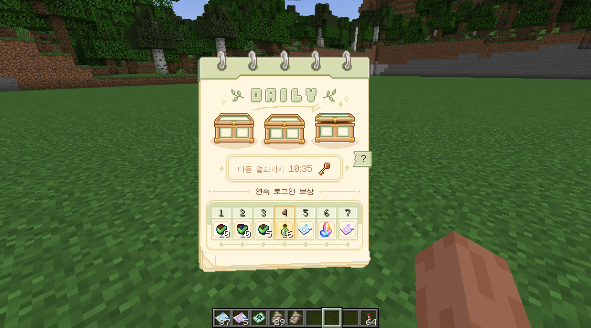
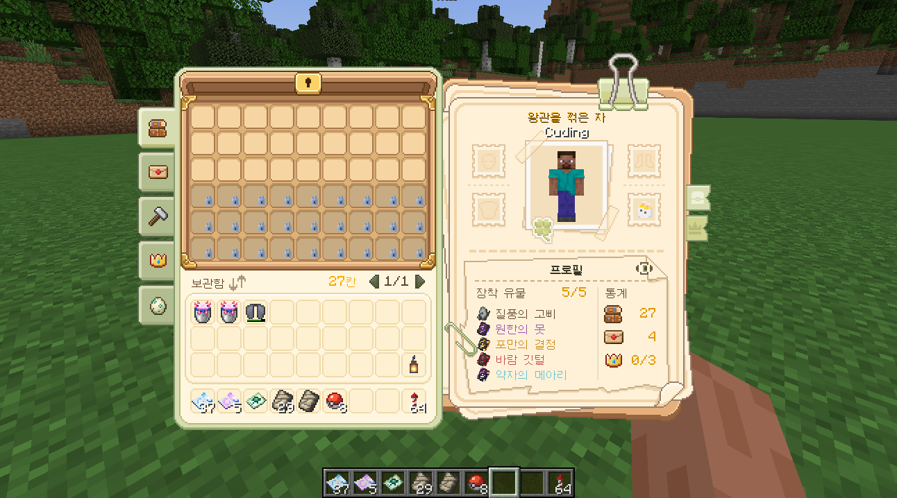
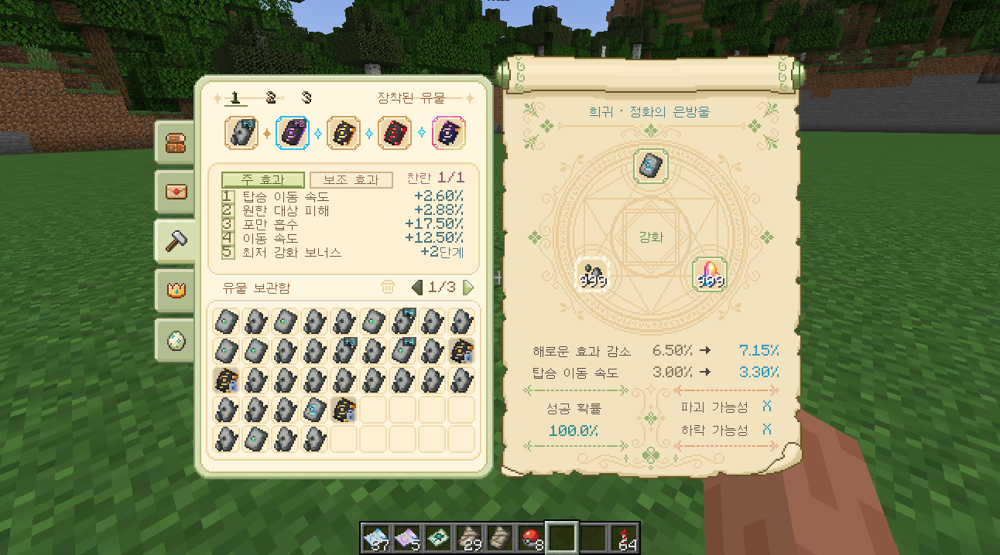

# 개인 서버용 코어 모드

> 개인 코블몬 서버의 성장, 경제, 보상, 수집과 이벤트를 하나의 플레이 흐름으로 연결하는 NeoForge 1.21.1 기반 모드입니다.

이 저장소는 실행 가능한 배포본이 아니라, 직접 작성한 Java 코드와 주요 구현 내용을 정리해 공개하는 소스 저장소입니다. 게임 리소스와 외부 모드는 포함하지 않으므로 이 저장소만으로 완성된 모드를 실행할 수 없습니다.

## 서버 플레이를 하나의 메뉴로

서버 안에서 흩어지기 쉬운 프로필, 보관함, 우편, 거래, 수집과 보상 기능을 하나의 인터페이스로 묶었습니다. 플레이어는 같은 화면 흐름 안에서 자신의 진행 상황을 확인하고, 획득한 보상을 정리하며, 서버 콘텐츠에 참여할 수 있습니다.

<table>
  <tr>
    <td width="50%"></td>
    <td width="50%"></td>
  </tr>
  <tr>
    <td align="center">보관함과 프로필</td>
    <td align="center">유물 관리와 강화</td>
  </tr>
</table>

## 시스템 상세

### 통합 메뉴와 공개 프로필

전용 단축키로 마지막에 사용한 메뉴를 다시 열 수 있으며, 보관함·우편함·유물·거래소·거북이 경주를 화면 왼쪽의 탭으로 오갑니다. 읽지 않은 우편과 판매 완료 같은 새 소식은 탭 배지와 알림으로 표시하고, 메뉴를 전환해도 페이지와 커서 위치를 가능한 한 유지합니다.

개인 보관함은 기본 27칸에서 시작해 유물 효과에 따라 확장됩니다. 한 페이지에 54칸씩 표시하며, 현재 페이지 정렬과 슬롯 잠금을 지원합니다. 잠근 슬롯은 아이템 이동과 정렬 대상에서 제외되므로 중요한 아이템을 그대로 보존할 수 있습니다.

공개 프로필에는 대표 칭호와 업적, 활동, 가챠, 유물, 보물 토끼와 거북이 경주 기록을 요약합니다. 공유 여부는 플레이어가 직접 선택하며, 재화 잔액·인벤토리·좌표·정확한 유물 효과와 개인 기록은 다른 사람에게 공개하지 않습니다.

### 접속 보상과 가챠

첫 접속 보상과 일일 연속 접속 보상은 우편함의 지급 기록과 연결되어 중복 수령을 막습니다. 로그인 화면에는 7일 보상 흐름과 세 개의 일일 보너스 상자가 함께 표시됩니다. 상자 내용은 플레이어와 날짜를 기준으로 서버에서 미리 확정하며, 열쇠를 모두 사용한 뒤에는 남은 결과를 확인할 수 있습니다. 보상 일자, 열쇠 지급과 상점의 일일 한도는 하나의 설정된 초기화 시각을 공유합니다.

포켓몬 가챠는 서버가 세 후보와 공 위치를 먼저 확정한 뒤, 플레이어가 월드에 나타난 공 하나를 선택하는 방식입니다. 선택 전 취소·사망·차원 이동과 시간 초과가 발생하면 티켓을 반환하고, 정상적으로 선택한 뒤에는 확정된 결과를 지급해 연출을 보고 다시 뽑는 일을 막습니다. 후보 정보와 선택 권한은 서버가 검증하며 클라이언트는 공의 낙하, 흔들림과 포켓몬 등장 연출만 담당합니다.

가챠 도감에서는 티켓별 포켓몬·유물 목록, 희귀도와 개별 확률을 확인할 수 있습니다. 포켓몬, 유물과 파티클 장식은 각각의 티켓과 결과 처리 흐름을 사용하며, 천장 횟수와 획득 통계는 플레이어 데이터에 저장됩니다.

### 경제, 거래소와 우편함

서버 재화는 금화와 보석으로 나뉩니다. 금화는 건축 재료 상점과 플레이어 거래에, 보석은 설정된 가챠 티켓과 장식 교환에 사용합니다. 일일 상자에서 이미 보유한 고희귀도 장식이 다시 나온 경우에는 설정된 양의 보석으로 전환해 중복 보상의 가치를 유지합니다.

거래소는 서버 상점, 플레이어 판매 목록, 내 판매 관리와 완료된 판매 기록을 한 화면에서 제공합니다. 판매할 아이템은 등록과 동시에 서버가 보관하고, 취소·만료·판매 결과는 인벤토리 또는 우편으로 돌려줍니다. 등록 전에 총액, 개당 가격, 수수료와 예상 정산액을 보여 주며, 최근 거래 중앙값과 크게 다른 가격에는 경고를 표시합니다.

우편함은 접속 보상, 거래 정산, 이벤트 보상과 운영자 지급을 하나의 안전한 수령 경로로 연결합니다. 오프라인 플레이어에게도 결과를 보관하고, 첨부 아이템을 모두 받은 읽은 우편은 자동으로 정리합니다. 보관 한도와 복구 대기열을 두어 우편이 무한히 쌓이거나 거래 보상이 사라지는 상황을 방지합니다.

### 유물

유물은 희귀도, 주 효과, 보조 효과와 강화 수치를 가진 서버 성장 장비입니다. 플레이어는 다섯 개의 장착 슬롯과 세 개의 프리셋을 사용하며, 보관함에서 유물을 골라 강화하거나 여러 개를 한 번에 분해해 강화 재료로 바꿀 수 있습니다. 강화 단계는 `+0`부터 `+10`까지이고 단계별 성공 확률과 증가량은 서버 설정으로 관리합니다.

같은 효과의 유물을 여러 개 장착하면 가장 높은 수치 하나만 적용되며, 특별 그룹에 속한 유물은 동시에 하나만 사용할 수 있습니다. 프리셋 교체와 강화 결과는 전체 장착 상태를 검증한 뒤 한 번에 반영합니다. 보관함 확장 효과가 줄어 잠길 칸에 아이템이 남는 경우에는 해제나 교체를 거부해 아이템 유실을 막습니다.

유물 효과는 코블몬의 경험치·친밀도·포획·야생 출현과 연결되며, 이동 속도·체력·상호작용 거리와 같은 플레이어 능력에도 적용됩니다. Waystones, Mega Showdown, 음식 품질 및 치명타 모드가 설치된 환경에서는 해당 기능을 사용하는 선택 유물이 추가로 활성화됩니다.

### 꾸미기와 칭호

꾸미기는 머리·몸·발 위치에 장착하는 모델과 트레일·고리·궤도·날개·오라·동행체 형태의 파티클로 구성됩니다. 모델 장식은 플레이어의 머리와 몸 움직임을 따라가며, 파티클 장식은 주변 플레이어가 각자의 클라이언트에서 재현합니다. 거리, 표시 인원과 프레임 상태에 따라 파티클 밀도를 줄여 여러 사람이 모인 장소의 부하를 제한합니다.

보유 목록에서는 종류별 탐색, 즐겨찾기 우선 정렬과 캐릭터 미리보기를 제공합니다. 보유하지 않은 모델을 미리 착용해 볼 수 있지만 이 상태는 화면 안에서만 보이며 서버의 실제 장착 정보는 바뀌지 않습니다.

칭호는 장식 화면에서 선택하고 채팅, 플레이어 목록과 월드 이름표에 아이콘으로 표시합니다. 칭호의 보유 상태와 현재 사용 중인 칭호를 분리해, 장착을 해제하더라도 획득 기록은 유지합니다.

### 서버 이벤트와 주간 신문

일일 이벤트는 보상과 같은 서버 날짜 경계를 사용해 그날의 야생 포켓몬 이로치 확률 배율을 결정합니다. 단기 속보 이벤트는 대량 발생, 협동 포획, 보물 토끼 무리와 낚시 축제로 구성되며, 서버 전체에서 한 번에 하나만 열어 참가자와 보상 상태가 서로 섞이지 않도록 합니다.

협동 포획은 접속 인원에 따라 공동 목표를 조정하고 개인 기여 상한을 둡니다. 대량 발생과 보물 토끼 무리는 월드에 실제 탐색 지역을 만들며, Xaero 월드맵이 설치되어 있으면 해당 범위를 지도에 표시합니다. 매주 토요일의 잉어킹 낚시 축제는 정해진 시간과 수역 안에서 별도의 낚시 결과와 첫 참가 보상을 제공합니다.

일반 탐험에서 만나는 보물 토끼는 서버 전체 속보와 분리된 개인 사건입니다. 변종에 따라 금화·보석·가챠 티켓과 유물 재료를 지급하며, 왕관 토끼는 여러 플레이어가 함께 추적하는 공동 목표로 동작합니다.

주간 신문은 유물과 이로치 획득, 보물 토끼 발견, 거래소 판매와 속보 결과를 한 주 동안 집계합니다. 원시 기록을 그대로 나열하는 대신 결과에 맞는 기사 형식으로 편집해 우편으로 발행하며, 첨부 보상도 일반 우편 수령 절차를 사용합니다.

### 거북이 경주

거북이를 부화시키면 속력·가속력·코너링·추월과 지구력의 다섯 능력치, 고유 액티브와 패시브 구성이 결정됩니다. 플레이어는 제한된 훈련 횟수를 어디에 배분할지 선택하고, 발전 과제로 해금한 동행 친구와 등딱지 외형을 설정해 자신만의 경주 거북이를 육성합니다.

경주 전략은 선두 주행, 안정 주행, 대열 추적과 막판 승부 네 가지입니다. 전략은 능력치를 단순히 올리는 대신 목표 속도, 위치 선정, 추월 시점과 지구력 사용 방식을 바꿉니다. 코스는 모래·진흙·수면을 조합하며 맑음, 가랑비, 바닷바람과 숲 안개 같은 경기장 지역 날씨가 스킬과 동행 친구의 조건에 영향을 줍니다.

공식전 결과로 레이스 포인트를 얻어 D부터 S까지 진급합니다. 시범전과 타임어택에서는 성장 보상 없이 다양한 난이도와 코스를 시험할 수 있으며, 관전자는 전용 HUD와 경기 해설을 통해 순위, 지구력, 스킬 발동과 주요 구간을 확인합니다. 베팅, 경기 재생과 운영자용 코스·효과 미리보기도 같은 경기 상태를 사용합니다.

부화 결과, 훈련, 패시브 재선택 후보와 경기 기록은 서버에 먼저 저장합니다. 접속 종료나 서버 재시작이 발생해도 이미 소비한 재료와 확정된 후보를 복구할 수 있도록 육성과 보상 단계를 분리했습니다.

### 저장과 운영 안전성

재화, 우편, 거래소, 이벤트와 경주 결과는 서버가 최종 판단하며 클라이언트가 보낸 요청의 대상·거리·소유권과 현재 상태를 다시 확인합니다. 처리 중인 버튼은 서버 응답이 올 때까지 잠그고, 응답이 늦어지면 자동 재시도 없이 오류를 알려 중복 요청을 줄입니다.

플레이어 데이터와 서버 공용 데이터는 역할별 저장 영역으로 나누고, 경제 흐름과 주요 운영 작업은 별도의 감사 기록에 남깁니다. 설정 파일은 항목과 버전을 검증한 뒤 적용하며, 유물 설정처럼 진행 데이터에 직접 영향을 주는 파일이 잘못된 경우에는 기존 파일을 백업하고 마지막 정상 설정 또는 기본값으로 복구합니다.

## 구현 구성

| 영역 | 주요 코드 | 역할 |
| --- | --- | --- |
| 메뉴와 화면 | [`menu`](src/main/java/com/yoiko/core/menu), [`client/screen`](src/main/java/com/yoiko/core/client/screen) | 서버 메뉴 흐름, 공통 위젯, 프로필·보관함·우편·거래소 화면 |
| 성장과 보상 | [`reward`](src/main/java/com/yoiko/core/reward), [`rank`](src/main/java/com/yoiko/core/rank), [`gacha`](src/main/java/com/yoiko/core/gacha) | 접속 보상, 등급, 포켓몬 가챠와 도감 진행 |
| 경제와 거래 | [`economy`](src/main/java/com/yoiko/core/economy), [`mail`](src/main/java/com/yoiko/core/mail), [`storage`](src/main/java/com/yoiko/core/storage) | 화폐, 거래소, 우편과 개인 보관함 |
| 유물과 꾸미기 | [`relic`](src/main/java/com/yoiko/core/relic), [`cosmetic`](src/main/java/com/yoiko/core/cosmetic) | 유물 생애 주기와 효과, 장비형·파티클 꾸미기 |
| 이벤트 | [`event`](src/main/java/com/yoiko/core/event), [`treasure`](src/main/java/com/yoiko/core/treasure), [`newspaper`](src/main/java/com/yoiko/core/newspaper) | 일일 이벤트, 속보, 보물 토끼와 주간 신문 |
| 거북이 경주 | [`turtle`](src/main/java/com/yoiko/core/turtle) | 육성, 훈련, 전략, 경기 시뮬레이션과 타임 트라이얼 |
| 저장과 통신 | [`data`](src/main/java/com/yoiko/core/data), [`network`](src/main/java/com/yoiko/core/network) | 플레이어·서버 상태 저장, 감사 기록과 클라이언트 동기화 |

## 개발 환경과 연동 모드

### 개발 환경

- Minecraft `1.21.1`
- NeoForge `21.1.234`
- Java `21`
- Cobblemon `1.7.3` 이상

### 선택 연동

| 모드 ID | 연동 기능 |
| --- | --- |
| `critical_strike` | 치명타 확률과 피해 관련 유물 효과 |
| `waystones` | 귀환 부적 유물 효과 |
| `mega_showdown` | 메가진화 관련 유물 효과 |
| `quality_food` | 음식 품질 관련 유물 효과 |
| `xaeroworldmap` | 속보 및 탐색 구역의 월드맵 표시 |

선택 연동 모드는 이 저장소에 포함하지 않으며, 각 모드의 저작권과 이용 조건은 원 제작자와 배포처의 정책을 따릅니다.

## 저장소 안내

이 저장소에는 다음 항목만 공개합니다.

- `src/main/java` 아래의 직접 작성한 Java 소스 코드
- 의존성과 프로젝트 구조를 설명하는 Gradle 설정
- NeoForge 모드 메타데이터 템플릿
- 저장소 소개를 위해 선별한 스크린샷

다음 항목은 공개하지 않습니다.

- 언어 파일, 모델, 애니메이션, 지오메트리와 데이터팩을 포함한 게임 리소스
- 코블몬을 비롯한 외부 모드와 외부 모드에서 추출한 자료
- 도트 이미지 원본, 편집 파일과 제작 중간 산출물
- 개발용 참고 자료, 설계 문서, 로그, 백업과 운영 데이터
- JAR 및 컴파일된 클래스와 같은 바이너리 파일

따라서 공개 저장소의 내용만으로 실제 서버에서 사용하는 완성된 모드를 재현하거나 배포할 수 없습니다.

## 저작권과 이용 조건

직접 작성한 프로젝트 코드와 문서는 별도 표시가 없는 한 모든 권리를 보유합니다. `TEMPLATE_LICENSE.txt`는 NeoForge MDK에서 제공된 템플릿 파일에만 적용됩니다.

> [!IMPORTANT]
> README 스크린샷에 포함된 UI 도트 그래픽, 아이콘과 그 밖의 직접 제작 시각물은 무단 복제를 허용하지 않습니다. 사전 서면 허가 없이 그 전체 또는 일부를 추출·복제·수정·재배포하거나 다른 프로젝트에 사용하는 것을 금지합니다. 저장소 공개는 이러한 시각물에 대한 이용 허락을 의미하지 않습니다.

README의 스크린샷은 프로젝트 소개를 위한 기록입니다. 화면에 포함된 Minecraft, Cobblemon 및 다른 외부 구성요소의 권리는 각 권리자에게 귀속됩니다.
